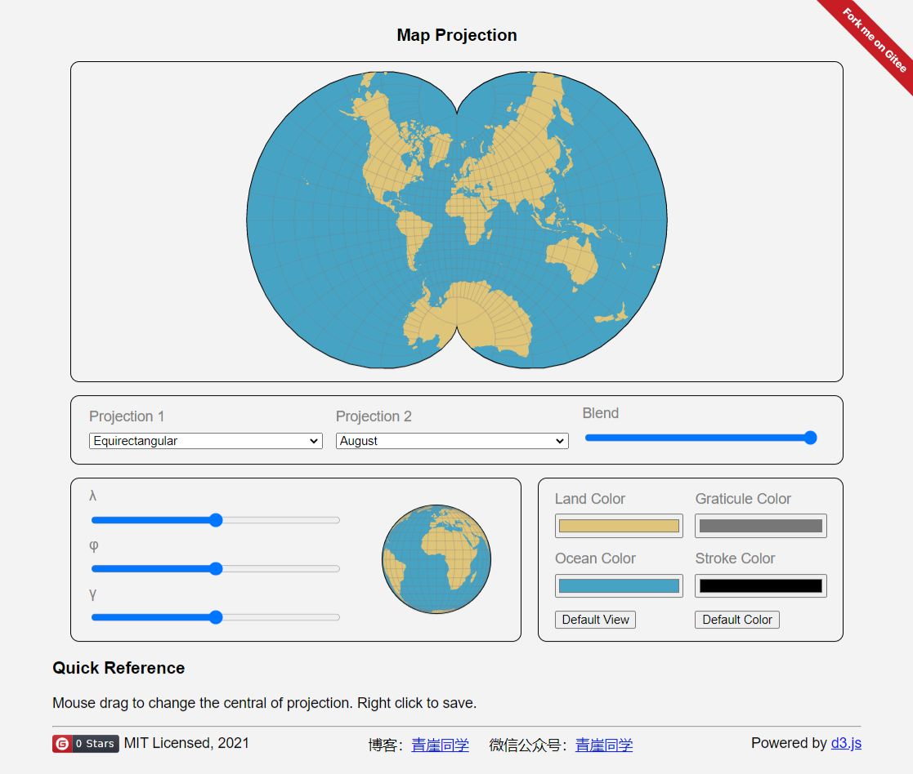

# Map Projection

一个[地图投影的网页](https://qingyaya.gitee.io/mapprojection)：

支持的投影：

- [Aitoff](https://github.com/d3/d3-geo-projection/#geoAitoff)
- [Albers](https://github.com/d3/d3-geo-projection/#geoAlbers)
- [August](https://github.com/d3/d3-geo-projection/#geoAugust)
- [Baker](https://github.com/d3/d3-geo-projection/#geoBaker)
- [Boggs](https://github.com/d3/d3-geo-projection/#geoBoggs)
- [Bonne](https://github.com/d3/d3-geo-projection/#geoBonne)
- [Bottomley](https://github.com/d3/d3-geo-projection/#geoBottomley)
- [Bromley](https://github.com/d3/d3-geo-projection/#geoBromley)
- [Collignon](https://github.com/d3/d3-geo-projection/#geoCollignon)
- [Conic Equal Area](https://github.com/d3/d3-geo-projection/#geoConicEqualArea)
- [Conic Equidistant](https://github.com/d3/d3-geo-projection/#geoConicEquidistant)
- [Craster Parabolic](https://github.com/d3/d3-geo-projection/#geoCraster)
- [Cylindrical Equal Area](https://github.com/d3/d3-geo-projection/#geoCylindricalEqualArea)
- [Cylindrical Stereographic](https://github.com/d3/d3-geo-projection/#geoCylindricalStereographic)
- [Eckert I](https://github.com/d3/d3-geo-projection/#geoEckert1)
- [Eckert II](https://github.com/d3/d3-geo-projection/#geoEckert2)
- [Eckert III](https://github.com/d3/d3-geo-projection/#geoEckert2)
- [Eckert IV](https://github.com/d3/d3-geo-projection/#geoEckert3)
- [Eckert V](https://github.com/d3/d3-geo-projection/#geoEckert4)
- [Eckert VI](https://github.com/d3/d3-geo-projection/#geoEckert5)
- [Eisenlohr](https://github.com/d3/d3-geo-projection/#geoEisenlohr)
- [Equirectangular](https://github.com/d3/d3-geo-projection/#geoEquirectangular)
- [Fahey](https://github.com/d3/d3-geo-projection/#geoFahey)
- [Foucaut](https://github.com/d3/d3-geo-projection/#geoFoucaut)
- [Foucaut Sinusoidal](https://github.com/d3/d3-geo-projection/#geoFoucautSinusoidal)
- [Gilbert](https://github.com/d3/d3-geo-projection/#geoGilbert)
- [Ginzburg IV](https://github.com/d3/d3-geo-projection/#geoGinzburg4)
- [Ginzburg V](https://github.com/d3/d3-geo-projection/#geoGinzburg5)
- [Ginzburg VI](https://github.com/d3/d3-geo-projection/#geoGinzburg6)
- [Ginzburg VIII](https://github.com/d3/d3-geo-projection/#geoGinzburg8)
- [Ginzburg IX](https://github.com/d3/d3-geo-projection/#geoGinzburg9)
- [Gringorten](https://github.com/d3/d3-geo-projection/#geoGringorten)
- [Guyou](https://github.com/d3/d3-geo-projection/#geoGuyou)
- [Hammer](https://github.com/d3/d3-geo-projection/#geoHammer)
- [Hill](https://github.com/d3/d3-geo-projection/#geoHill)
- [Homolosine](https://github.com/d3/d3-geo-projection/#geoHomolosine)
- [Hufnagel](https://github.com/d3/d3-geo-projection/#geoHufnagel)
- [Hyperelliptical](https://github.com/d3/d3-geo-projection/#geoHyperelliptical)
- [Kavrayskiy VII](https://github.com/d3/d3-geo-projection/#geoKavrayskiy7)
- [Lagrange](https://github.com/d3/d3-geo-projection/#geoLagrange)
- [Larrivée](https://github.com/d3/d3-geo-projection/#geoLarrivee)
- [Laskowski](https://github.com/d3/d3-geo-projection/#geoLaskowski)
- [Loximuthal](https://github.com/d3/d3-geo-projection/#geoLoximuthal)
- [Miller](https://github.com/d3/d3-geo-projection/#geoMiller)
- [Mollweide](https://github.com/d3/d3-geo-projection/#geoMollweide)
- [McBryde–Thomas Flat-Polar Parabolic](https://github.com/d3/d3-geo-projection/#geoMtFlatPolarParabolic)
- [McBryde–Thomas Flat-Polar Quartic](https://github.com/d3/d3-geo-projection/#geoMtFlatPolarQuartic)
- [McBryde–Thomas Flat-Polar Sinusoidal](https://github.com/d3/d3-geo-projection/#geoMtFlatPolarSinusoidal)
- [Natural Earth I](https://github.com/d3/d3-geo-projection/#geoNaturalEarth1)
- [Natural Earth II](https://github.com/d3/d3-geo-projection/#geoNaturalEarth2)
- [Nell–Hammer](https://github.com/d3/d3-geo-projection/#geoNellHammer)
- [Nicolosi](https://github.com/d3/d3-geo-projection/#geoNicolosi)
- [Orthographic](https://github.com/d3/d3-geo-projection/#geoOrthographic)
- [Patterson](https://github.com/d3/d3-geo-projection/#geoPatterson)
- [Polyconic](https://github.com/d3/d3-geo-projection/#geoPolyconic)
- [Rectangular Polyconic](https://github.com/d3/d3-geo-projection/#geoRectangularPolyconic)
- [Robinson](https://github.com/d3/d3-geo-projection/#geoRobinson)
- [Satellite](https://github.com/d3/d3-geo-projection/#geoSatellite)
- [Sinusoidal](https://github.com/d3/d3-geo-projection/#geoSinusoidal)
- [Sinu-Mollweide](https://github.com/d3/d3-geo-projection/#geoSinuMollweide)
- [Times](https://github.com/d3/d3-geo-projection/#geoTimes)
- [van der Grinten](https://github.com/d3/d3-geo-projection/#geoVanDerGrinten)
- [van der Grinten II](https://github.com/d3/d3-geo-projection/#geoVanDerGrinten2)
- [van der Grinten III](https://github.com/d3/d3-geo-projection/#geoVanDerGrinten3)
- [van der Grinten IV](https://github.com/d3/d3-geo-projection/#geoVanDerGrinten4)
- [Wagner](https://github.com/d3/d3-geo-projection/#geoWagner)
- [Wagner IV](https://github.com/d3/d3-geo-projection/#geoWagner4)
- [Wagner VI](https://github.com/d3/d3-geo-projection/#geoWagner6)
- [Wagner VII](https://github.com/d3/d3-geo-projection/#geoWagner7)
- [Winkel III](https://github.com/d3/d3-geo-projection/#geoWinkel3)
